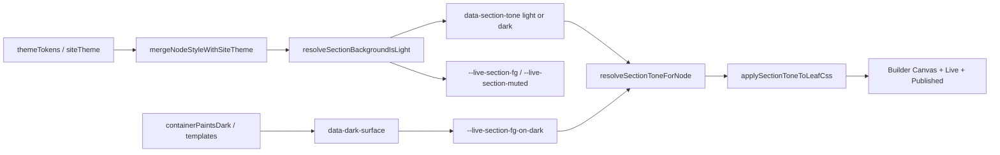

# Agent guide — Builder-custom

## Section Contrast Rules

Permanent architecture for readable copy in **light site mode**, **dark site mode**, and **mixed sections** (e.g. black pitch card inside a light grey row).

### Section contrast flow



| Step | Module / file |
|------|----------------|
| Site theme | `lib/siteDesignTheme.js`, `lib/themeTokens.js` |
| Row/column contrast vars | `lib/liveSectionContrastVars.js` → `--live-section-fg`, `--live-section-muted` |
| Template dark bands / pitch | `lib/getInTouchSection.js` → `applyTemplateSectionContrast()`, `data-dark-surface` |
| Leaf tone from tree | `lib/sectionToneContext.js` → `resolveSectionToneForNode()`, `applySectionToneToLeafCss()` |
| Render parity | `lib/liveRenderer.js`, `lib/builderLiveParity.js`, `components/builder/BuilderCanvas.jsx` |
| Dark copy CSS | `styles/shared/dark-surface-copy.css` |

---

### 1. Never use hardcoded text colors

**Forbidden** on typography / copy:

```css
color: #0f172a;
color: #111827;
color: #ffffff;
color: #f8fafc;
```

**Use:**

```css
color: var(--live-section-fg);
color: var(--live-section-muted);
color: var(--live-section-fg-on-dark); /* dark-painted surfaces only */
```

Token aliases: `--token-text-primary`, `--token-text-muted` (see `styles/shared/live-semantic-tokens.css`).

---

### 2. Dark surface rule

If a column, card, or stack has an **opaque dark** background:

**Required:** `data-dark-surface="true"` **or** `applyTemplateSectionContrast()` (sets tone + contrast vars).

**Copy on dark surfaces:** `var(--live-section-fg-on-dark)` — **never** `var(--live-section-fg)` inside nested dark cards (it inherits the light parent row’s `#0f172a`).

---

### 3. Section tone rule

Every template section must expose:

- `data-section-tone="light"` or `data-section-tone="dark"`

via `resolveSectionToneForNode()` and container `applyTemplateSectionContrast()` / `sectionToneDataAttrForCss()`.

Do **not** apply light-tone CSS to all descendants of a light row.

---

### 4. New template rule

Before merge, manually verify:

- Light site preset
- Dark site preset
- Mixed section page (dark card inside light section)
- Builder canvas, draft preview, published live

---

### 5. Theme token rule

Use semantic tokens; do not introduce new hardcoded slate neutrals in `styles/shared/*`, `styles/live/*`, or template CSS.

---

### 6. Builder / live parity rule

Any contrast fix must use the same pipeline for:

- Builder canvas (`.bld-canvas__live-mirror`)
- Draft preview
- Published live (`.live-doc`)

No builder-only overrides that skip `liveRenderer`.

---

### 7. Regression tests

When adding a section template, extend:

| Test file | Covers |
|-----------|--------|
| `tests/sectionToneContext.test.mjs` | `resolveSectionToneForNode`, `applySectionToneToLeafCss` |
| `tests/darkSurfaceContext.test.mjs` | `data-dark-surface`, `applyTemplateSectionContrast` |
| `tests/mixedContrastContext.test.mjs` | Light row + dark nested column |
| `tests/getInTouchSection.test.mjs` | Template detection |
| `tests/darkModeRegression.test.mjs` | CSS audit + health score |

Run: `npm test`

---

### 8. Lint / audit

```bash
npm run audit:section-contrast
```

Warns when banned neutrals (`#0f172a`, `#111827`, `#ffffff`, `#f8fafc`, …) appear on `color` / `background` in audited CSS. Implemented in `scripts/audit-hardcoded-colors.mjs`.

---

### Cursor rule

`.cursor/rules/section-contrast.mdc` — loaded when editing `lib/`, `styles/`, `components/`, or `tests/`.
