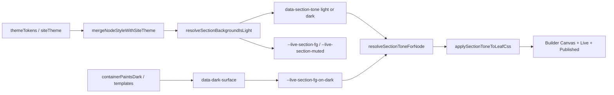

# Agent guide — Builder-custom

## Section Contrast Rules

Permanent architecture for readable copy in **light site mode**, **dark site mode**, and **mixed sections** (e.g. black pitch card inside a light grey row).

### Section contrast flow



| Step | Module / file |
|------|----------------|
| Site theme | `lib/siteDesignTheme.js`, `lib/themeTokens.js` |
| Row/column contrast vars | `lib/liveSectionContrastVars.js` → `--live-section-fg`, `--live-section-muted` |
| Template dark bands / pitch | `lib/getInTouchSection.js` → `applyTemplateSectionContrast()`, `data-dark-surface` |
| Leaf tone from tree | `lib/sectionToneContext.js` → `resolveSectionToneForNode()`, `applySectionToneToLeafCss()` |
| Render parity | `lib/liveRenderer.js`, `lib/builderLiveParity.js`, `components/builder/BuilderCanvas.jsx` |
| Dark copy CSS | `styles/shared/dark-surface-copy.css` |

---

### 1. Never use hardcoded text colors

**Forbidden** on typography / copy:

```css
color: #0f172a;
color: #111827;
color: #ffffff;
color: #f8fafc;
```

**Use:**

```css
color: var(--live-section-fg);
color: var(--live-section-muted);
color: var(--live-section-fg-on-dark); /* dark-painted surfaces only */
```

Token aliases: `--token-text-primary`, `--token-text-muted` (see `styles/shared/live-semantic-tokens.css`).

---

### 2. Dark surface rule

If a column, card, or stack has an **opaque dark** background:

**Required:** `data-dark-surface="true"` **or** `applyTemplateSectionContrast()` (sets tone + contrast vars).

**Copy on dark surfaces:** `var(--live-section-fg-on-dark)` — **never** `var(--live-section-fg)` inside nested dark cards (it inherits the light parent row’s `#0f172a`).

---

### 3. Section tone rule

Every template section must expose:

- `data-section-tone="light"` or `data-section-tone="dark"`

via `resolveSectionToneForNode()` and container `applyTemplateSectionContrast()` / `sectionToneDataAttrForCss()`.

Do **not** apply light-tone CSS to all descendants of a light row.

---

### 4. New template rule

Before merge, manually verify:

- Light site preset
- Dark site preset
- Mixed section page (dark card inside light section)
- Builder canvas, draft preview, published live

---

### 5. Theme token rule

Use semantic tokens; do not introduce new hardcoded slate neutrals in `styles/shared/*`, `styles/live/*`, or template CSS.

---

### 6. Builder / live parity rule

**Jo builder me dikhe, wahi preview aur live par dikhna chahiye** — permanently enforced.

#### One render pipeline

- All three surfaces render through `lib/liveRenderer.js` (builder mirror uses the same components).
- Do **not** add builder-only React trees or duplicate widget markup in `BuilderCanvas.jsx`.

#### One CSS surface

Layout CSS for live widgets must target the parity surface:

```css
:is(.live-doc, .bld-canvas__live-mirror) …
```

Defined in `lib/paritySurface.js` as `PARITY_SURFACE_SELECTOR`.

**Forbidden** for widget layout (overflow, height, object-fit, etc.):

```css
.bld-canvas__page [data-section-template='featureTabs'] { overflow: visible; }
.bld-demo-feature-tabs { height: 360px; }
```

**Allowed** builder-only CSS: selection chrome, pointer-events, placeholders (see `PARITY_BUILDER_CHROME_ALLOW`).

Put shared widget layout in `styles/shared/*`, not split across `styles/builder/*` + `styles/live/*`.

| Shared file | Widgets / templates |
|-------------|---------------------|
| `styles/shared/feature-tabs.css` | Feature tabs layout + images |
| `styles/shared/section-template-parity.css` | FAQ, blogs, hero, carousel, other `data-section-template` layout |

#### Inline style contracts

When global `.live-doc img` or mobile rules can override widget sizing, use a JS contract in `lib/*` and register it in `PARITY_INLINE_STYLE_CONTRACTS` (`lib/paritySurface.js`). Example: `lib/featureTabPanelImage.js` + `data-ft-panel-image`.

#### Regression tests + audit

| Test / script | Covers |
|---------------|--------|
| `tests/builderLiveParityAudit.test.mjs` | No builder-only widget layout overrides in CSS |
| `npm run audit:builder-live-parity` | Same audit (CI-friendly) |

Run `npm test` before merge. New widgets/templates must pass the parity audit.

---

### 7. Regression tests

When adding a section template, extend:

| Test file | Covers |
|-----------|--------|
| `tests/sectionToneContext.test.mjs` | `resolveSectionToneForNode`, `applySectionToneToLeafCss` |
| `tests/darkSurfaceContext.test.mjs` | `data-dark-surface`, `applyTemplateSectionContrast` |
| `tests/mixedContrastContext.test.mjs` | Light row + dark nested column |
| `tests/getInTouchSection.test.mjs` | Template detection |
| `tests/darkModeRegression.test.mjs` | CSS audit + health score |
| `tests/builderLiveParityAudit.test.mjs` | Builder ↔ preview ↔ live CSS parity |

Run: `npm test`

---

### 8. Lint / audit

```bash
npm run audit:section-contrast
npm run audit:builder-live-parity
```

- **section-contrast** — banned neutrals on `color` / `background` (`scripts/audit-hardcoded-colors.mjs`).
- **builder-live-parity** — builder-only widget layout overrides (`scripts/audit-builder-live-parity.mjs`).

---

### Cursor rules

- `.cursor/rules/section-contrast.mdc` — contrast tokens when editing `lib/`, `styles/`, `components/`, or `tests/`.
- `.cursor/rules/builder-live-parity.mdc` — builder = preview = live when adding widgets or CSS.
