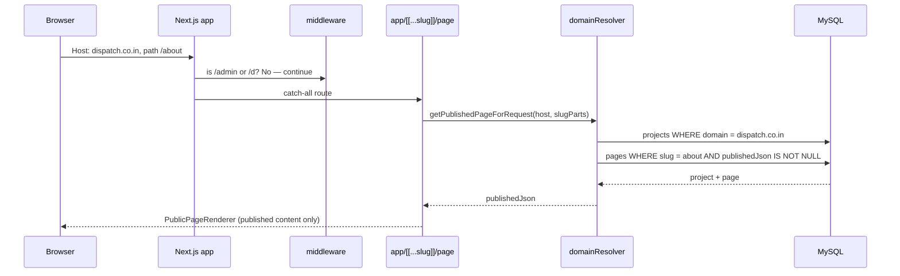

# Production domain mapping

This document describes how one Next.js deployment serves both the **builder/admin app** and **client public sites** in production, using host-based routing.

---

## Overview

| Role | Example host | Purpose |
|------|----------------|---------|
| Builder / admin | `builder.yourcompany.com` | Project manager (`/d`), legacy admin (`/admin`), builder, draft preview |
| Client site A | `dispatch.co.in` | Public published pages only |
| Client site B | `acenest.in` | Public published pages only |
| Client site C | `templetrust.org` | Public published pages only |

All hosts point at the **same Next.js application**. The app reads the request `Host` header, resolves the matching project, and renders that project’s published content.

---

## 1. Main builder / admin domain

Use a dedicated hostname for internal tooling — not a client brand domain.

**Production example:** `builder.yourcompany.com`

Set in environment:

```env
BUILDER_APP_HOST=builder.yourcompany.com
```

Allowed on this host:

- `/admin` — legacy admin console
- `/d` — project manager, builder (`/d/builder/[pageId]`), draft preview (`/d/preview/[pageId]`)
- `/preview` — legacy draft preview routes

Local development uses `localhost` / `127.0.0.1` as builder hosts automatically (no DNS required).

---

## 2. Client domains

Each client project gets its own public domain. Examples:

| Client | Public domain |
|--------|----------------|
| Dispatch | `dispatch.co.in` |
| Ace Nest | `acenest.in` |
| Temple Trust | `templetrust.org` |

Visitors on these domains see **only published pages**. They do not get builder UI, admin, or draft preview.

**URL shape on client domains:**

- Home page: `https://dispatch.co.in/` (uses the project’s `homeSlug`, typically `home`)
- Other pages: `https://dispatch.co.in/about`, `https://dispatch.co.in/contact`, etc.

Paths are flat (`/{pageSlug}`), not `/{projectSlug}/{pageSlug}`.

---

## 3. DNS setup

### Option A — VPS / self-hosted (single server IP)

For each client domain:

| Type | Name | Value |
|------|------|--------|
| **A** | `@` (apex / root) | Your server public IP |
| **CNAME** | `www` | Root domain (e.g. `dispatch.co.in`) |

Repeat for `acenest.in`, `templetrust.org`, etc.

Point `builder.yourcompany.com` the same way (A record to server IP, or CNAME if you use a subdomain of your own zone).

Ensure your reverse proxy (nginx, Caddy, etc.) forwards **all** of these hostnames to the Next.js process and preserves `Host` / `X-Forwarded-Host`.

### Option B — Vercel

1. Open the Vercel project that runs this app.
2. **Settings → Domains** — add each hostname:
   - `builder.yourcompany.com`
   - `dispatch.co.in`, `www.dispatch.co.in`
   - `acenest.in`, `www.acenest.in`
   - `templetrust.org`, `www.templetrust.org`
3. At each domain’s DNS provider, create the **A / CNAME records** exactly as Vercel shows in the domain setup UI.
4. Wait for verification (green check in Vercel).

`www` is optional but recommended; the app strips a leading `www.` when matching domains.

---

## 4. Database mapping

Store the **canonical public hostname** (no `www.`, no protocol) on each project:

```sql
UPDATE projects SET domain = 'dispatch.co.in' WHERE slug = 'dispatch';
UPDATE projects SET domain = 'acenest.in'     WHERE slug = 'acenest';
UPDATE projects SET domain = 'templetrust.org' WHERE slug = 'templetrust';
```

Or via Prisma / admin APIs when creating or editing a project.

**Rules:**

- `projects.domain` must match the normalized host visitors use (e.g. `dispatch.co.in`, not `https://www.dispatch.co.in`).
- Project `status` must be `ACTIVE`.
- Public pages must be **published** (`pages.status = published`, `publishedJson` not null).

**Legacy:** verified rows in `project_domains` also resolve a host to a project if `projects.domain` is unset.

**Local dev:** on `localhost`, the active project comes from `site_settings.activeProjectId` (set via “Set active” in `/d/projects`).

---

## 5. Request flow (public client site)

Example: `GET https://dispatch.co.in/about`



**Important:**

- Public routes use **`publishedJson` only** — never `draftJson`.
- Unpublished or missing pages return 404.
- The same app binary serves builder and all client sites; routing is entirely host + path driven.

**Code references:**

- Host → project: `lib/site/domainResolver.ts` → `getProjectByHost()`
- Published page: `getPublishedPageForRequest()`
- Render: `app/[[...slug]]/page.tsx` → `PublicPageRenderer`

---

## 6. Security — admin routes on builder host only

`/admin` and `/d` must **not** be reachable on client custom domains.

If someone visits `https://dispatch.co.in/admin` or `https://dispatch.co.in/d/projects`, **middleware** redirects them to `/` on that same host.

Admin and builder paths are allowed only when the request host is:

- `localhost` / `127.0.0.1` (development), or
- The host in `BUILDER_APP_HOST` (e.g. `builder.yourcompany.com`)

**Code reference:** `middleware.ts` — `isAdminOrDPath()` + `isBuilderAppHost()`.

Additional protection:

- `/d/*` and `/admin/*` (except login) require a valid admin session when `AUTH_DISABLED` is not set.
- Admin APIs use `guardAdminApi` with project-scoped permissions.

**Operational checklist:**

- [ ] `BUILDER_APP_HOST` set in production env
- [ ] Client domains **not** listed as builder host
- [ ] `projects.domain` set per client site
- [ ] Pages published before go-live
- [ ] DNS + TLS valid for every hostname

---

## Quick reference

| Host | `/` | `/about` | `/admin` | `/d/builder/1` |
|------|-----|----------|----------|----------------|
| `builder.yourcompany.com` | Active project home (localhost-style) or 404 | Published page if exists | ✅ Allowed | ✅ Allowed |
| `dispatch.co.in` | Dispatch home (`publishedJson`) | Dispatch `/about` if published | ❌ Redirect `/` | ❌ Redirect `/` |

---

## Related env vars

| Variable | Purpose |
|----------|---------|
| `BUILDER_APP_HOST` | Hostname allowed to serve `/admin` and `/d` |
| `DATABASE_URL` | MySQL connection for projects, pages, domains |
| `AUTH_DISABLED` | Dev only — skips session checks when `true` |

See `.env` for local defaults.
